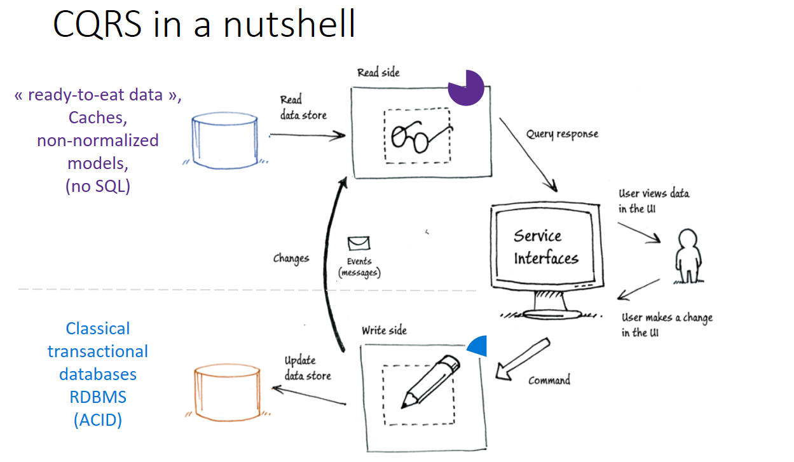

You should implement a simple booking solution in CQRS architecture.

## About CQRS

CQRS for Command Query Responsibility Segregation Pattern.

A query returns data and does not alter the state of the object. A command changes the state of an object but does not return any data.

We will split our code in read and write code to really live this pattern

## Booking subject

We want to make a booking solution for one hotel.

The first 2 users stories are :

- As a user i want to see all free rooms.
- As a user i want to book a room.
  They want to use the CQRS pattern, To do that we will have :

One command service with a function bookARoom(Booking) they call the WriteRegistry they notify the ReadRegistry called by query service with function Room[] freeRooms(arrival: Date, departure: Date)

The Booking struct contains

- client id
- room name
- arrival date
- departure date

And the Room struct contain only

- room name
- source

## Expectations

Your work will be evaluated primarily on:

- Cleanliness of the code
- Use modern ES6+ syntax, async/await, elegant & readable code
- `README.md` file explaining your high level solution and any decisions you made and the reasons behind them

### References

Inspiration source of this [kata](https://github.com/tpierrain/CQRS/)

Explanation of CQRS by [Microsoft](<https://docs.microsoft.com/en-us/previous-versions/msp-n-p/jj591573(v=pandp.10)>)
