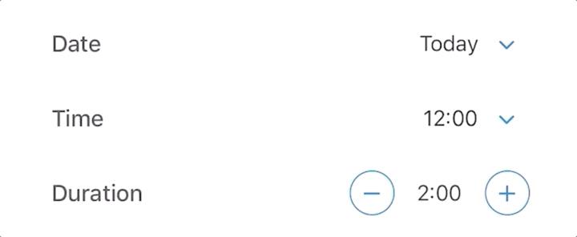

Calendar carousal is a mobile friendly component which give emphasis on selected date and time, you might have seen similar examples in booking related websites where selected dates must remain visible at all times for good UX.

## Task

Goal is to create an extensive developer friendly API with sane defaults, Key here is to relate to other developers and cover as much use cases as possible.

### Expectations

- All of the calendar’s state management and date logic should be bundled as a custom hook to increase reusability of the logic and modularity of the component.
- Document all possible use cases.
- Document the API clearly.
- Code must be self contained, keep external dependencies to minimal.
- Typechecking on the component API.
- 80% above test coverage.
