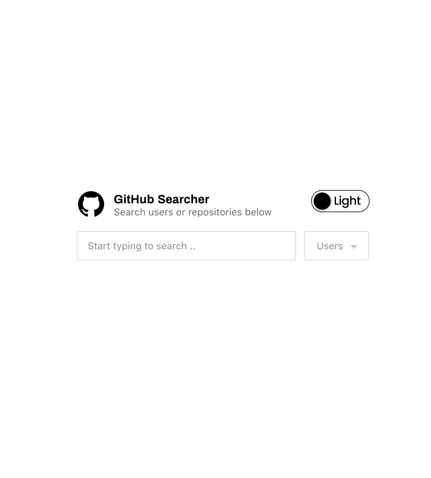
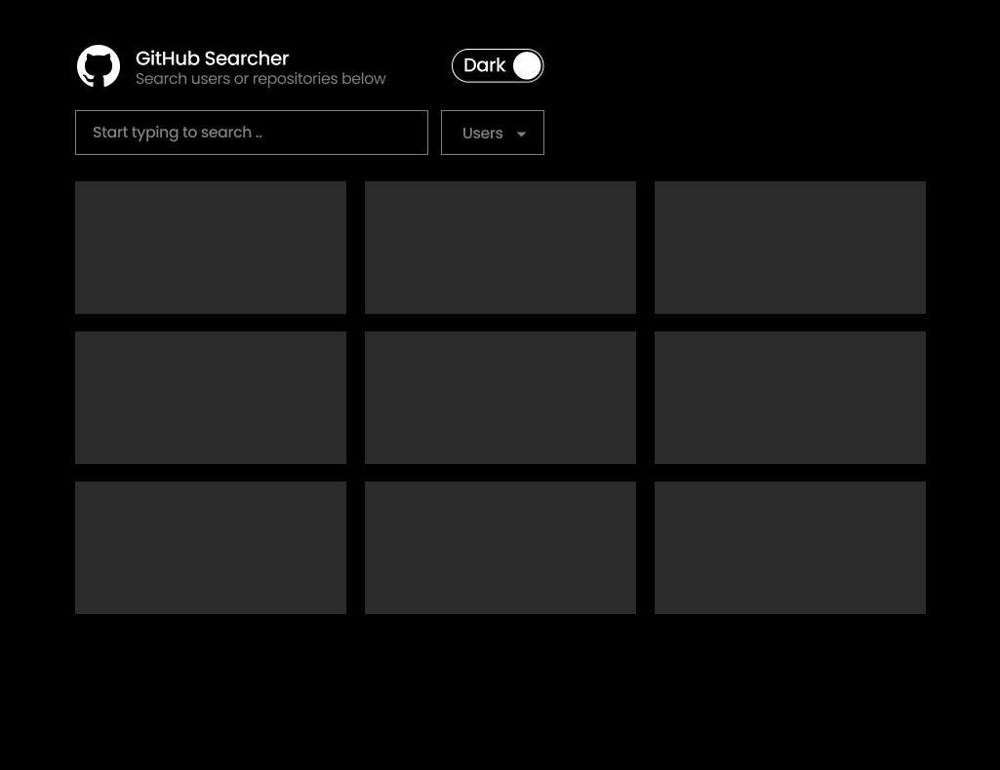
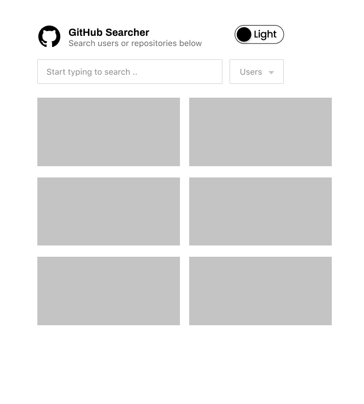

> Build a GitHub repository search application

This case study aims to assess how you approach a problem starting from the high level solution to the low level implementation details and code quality. You will not be penalized for asking questions, so don't hesitate to ask us if you need any clarification.

## The Task

You are required to build a simple single page application built with

- React.js
- [Custom Hooks](https://reactjs.org/docs/hooks-custom.html)
- [Tanstack react query](https://tanstack.com/query/latest/docs/react/overview)
-  [Pallas UI](https://pallas-ui-docs.vercel.app/), using its components and design tokens (and custom [Panda CSS](https://panda-css.com/) tokens and recipes, if necessary).

That allows the users to search the **users** or **repositories** or **issues** on GitHub. The results will be fetched from the GitHub API.

- [GitHub Search API Docs](https://developer.github.com/v3/search/)

## Requirements

There will be two input fields, on search field for the user to type the text and a dropdown where user can either pick "User" or "Repository" to define the entities that they want to search. When the user doesn't have any input or clears the input, the input fields should be shown in the middle of the page, styling all components using design tokens, add a switch in the header for switching between light and dark theme. The UI could roughly look like below:

When the user starts typing into the input, make an API call to fetch the results and display them in the form of grid below it. The data should be cached and persisted using React Query’s caching mechanisms and no more API calls should be made if we already have the results for the search term.

Here are some of the items that you should take care of

- Add debounce (feel free to import from lodash). Make the API calls only if the user has typed 3 or more characters. This would ensure minimum API Calls are made and we do not reach the maximum call limit. Debounce should be implemented as a reusable custom hook, where we can pass into it our desired callback function and custom delay timing.
- If the user changes the "Entity type" value in the dropdown and user has 3 or more characters in the input already, it should refresh the results.
- If the user clears the input or types less than three characters, clear the results and show the empty screen.
- The user can scroll down to see more results ( Infinite scrolling ) until the results are done. A custom hook for infinite scrolling should be designed. This custom hook should check whenever the last element is on screen and then the data should be updated accordingly.
- User should be able to toggle between light and dark theme.

The UI for the results could roughly look like below. The design for repository and user cards are up to you.

#### Light Mode

#### Dark Mode 

For each repository display the repository user details returned from API and the repository name, author, stars and other statistics below it. For the users, show the profile picture, name, location, any other data you have and link to their profile.

On smaller screens (width <= 768px), the grid will be 2 columns and it could look like below:

Consider all the states: initial, loading, error,... and inform the user about it.

## Expectations

Your work will be evaluated primarily on:

- Cleanliness of the code
- Use modern ES6+ syntax, async/await, elegant & readable code
- All the edge cases have been handled
- Proper use of Pallas UI components, design tokens and theme configurations.
- Use design tokens in such a way that changing a design token should reflect across the app.
- `README.md` file explaining your high level solution and any decisions you made and the reasons behind them
